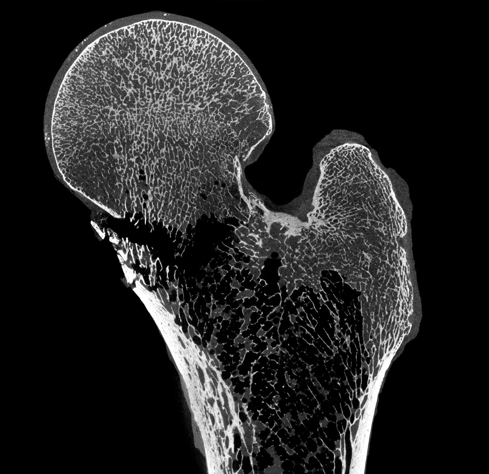

<!-- PROJECT SHIELDS -->
<!--
*** I'm using markdown "reference style" links for readability.
*** Reference links are enclosed in brackets [ ] instead of parentheses ( ).
*** See the bottom of this document for the declaration of the reference variables
*** for contributors-url, forks-url, etc. This is an optional, concise syntax you may use.
*** https://www.markdownguide.org/basic-syntax/#reference-style-links
-->
[![Contributors][contributors-shield]][contributors-url]
[![Forks][forks-shield]][forks-url]
[![Stargazers][stars-shield]][stars-url]
[![Issues][issues-shield]][issues-url]
[![MIT License][license-shield]][license-url]
[![LinkedIn][linkedin-shield]][linkedin-url]


<!-- PROJECT LOGO -->
<br />
<p align="center">
  <h3 align="center">Bone Microstructure vs. Whole Bone Strength Project</h3>

  <p align="center">
   A repository for all of the code for an in process manuscript. 
    <br />
    <a href="https://github.com/daniella-patton/Bone_Micro_Strength/readme"><strong>Explore the docs »</strong></a>
    <br />
  <a href="https://github.com/daniella-patton/Bone_Micro_Strength">
    
  </a>
    <br />
  </p>
</p>


<!-- TABLE OF CONTENTS -->
## Table of Contents

* [About the Project](#about-the-project)
  * [Built With](#built-with)
* [Getting Started](#getting-started)
  * [Prerequisites](#prerequisites)
  * [Installation](#installation)
* [Usage](#usage)
* [Roadmap](#roadmap)
* [Contributing](#contributing)
* [License](#license)
* [Contact](#contact)
* [Acknowledgements](#acknowledgements)


<!-- ABOUT THE PROJECT -->
## About The Project

The work in this project was created as part of work developed for 

The first objective of this study was to identify the cortical and trabecular traits in the femoral neck that best predicts bone strength in males and females. The second objective was to determine whether adding progressively more cortical and trabecular structural detail improves strength predictions and whether the additional detail is necessary to explain age and sex-specific differences in bone strength. We hypothesized that both cortical and trabecular parameters contribute to proximal femur strength and that localized regions of the femoral neck would better explain strength compared to measures that are averaged across the femoral neck.  


There are many great README templates available on GitHub, however, I didn't find one that really suit my needs so I created this enhanced one. I want to create a README template so amazing that it'll be the last one you ever need.

Here's why:
* Your time should be focused on creating something amazing. A project that solves a problem and helps others
* You shouldn't be doing the same tasks over and over like creating a README from scratch
* You should element DRY principles to the rest of your life :smile:

Of course, no one template will serve all projects since your needs may be different. So I'll be adding more in the near future. You may also suggest changes by forking this repo and creating a pull request or opening an issue.

A list of commonly used resources that I find helpful are listed in the acknowledgements.

### Built With
This section should list any major frameworks that you built your project using. Leave any add-ons/plugins for the acknowledgements section. Here are a few examples.
* [Bootstrap](https://getbootstrap.com)
* [JQuery](https://jquery.com)
* [Laravel](https://laravel.com)


<!-- GETTING STARTED -->
## Getting Started

This is an example of how you may give instructions on setting up your project locally.
To get a local copy up and running follow these simple example steps.

### Prerequisites

This is an example of how to list things you need to use the software and how to install them.
* npm
```sh
npm install npm@latest -g
```

### Installation

1. Get a free API Key at [https://example.com](https://example.com)
2. Clone the repo
```sh
git clone https://github.com/your_username_/Project-Name.git
```
3. Install NPM packages
```sh
npm install
```
4. Enter your API in `config.js`
```JS
const API_KEY = 'ENTER YOUR API';
```


<!-- USAGE EXAMPLES -->
## Usage

Use this space to show useful examples of how a project can be used. Additional screenshots, code examples and demos work well in this space. You may also link to more resources.

_For more examples, please refer to the [Documentation](https://example.com)_


<!-- ROADMAP -->
## Roadmap

See the [open issues](https://github.com/othneildrew/Best-README-Template/issues) for a list of proposed features (and known issues).


<!-- CONTRIBUTING -->
## Contributing

Contributions are what make the open source community such an amazing place to be learn, inspire, and create. Any contributions you make are **greatly appreciated**.

1. Fork the Project
2. Create your Feature Branch (`git checkout -b feature/AmazingFeature`)
3. Commit your Changes (`git commit -m 'Add some AmazingFeature'`)
4. Push to the Branch (`git push origin feature/AmazingFeature`)
5. Open a Pull Request


<!-- LICENSE -->
## License

Distributed under the MIT License. See `LICENSE` for more information.


<!-- CONTACT -->
## Contact

Your Name - [@your_twitter](https://twitter.com/your_username) - email@example.com

Project Link: [https://github.com/your_username/repo_name](https://github.com/your_username/repo_name)


<!-- ACKNOWLEDGEMENTS -->
## Acknowledgements
* [GitHub Emoji Cheat Sheet](https://www.webpagefx.com/tools/emoji-cheat-sheet)
* [Img Shields](https://shields.io)
* [Choose an Open Source License](https://choosealicense.com)
* [GitHub Pages](https://pages.github.com)
* [GitHub Pages for othneildrew](https://github.com/othneildrew/Best-README-Template)
* [Animate.css](https://daneden.github.io/animate.css)
* [Loaders.css](https://connoratherton.com/loaders)
* [Slick Carousel](https://kenwheeler.github.io/slick)
* [Smooth Scroll](https://github.com/cferdinandi/smooth-scroll)
* [Sticky Kit](http://leafo.net/sticky-kit)
* [JVectorMap](http://jvectormap.com)
* [Font Awesome](https://fontawesome.com)


<!-- MARKDOWN LINKS & IMAGES -->
<!-- https://www.markdownguide.org/basic-syntax/#reference-style-links -->
[contributors-shield]: https://img.shields.io/github/contributors/othneildrew/Best-README-Template.svg?style=flat-square
[contributors-url]: https://github.com/othneildrew/Best-README-Template/graphs/contributors
[forks-shield]: https://img.shields.io/github/forks/othneildrew/Best-README-Template.svg?style=flat-square
[forks-url]: https://github.com/othneildrew/Best-README-Template/network/members
[stars-shield]: https://img.shields.io/github/stars/othneildrew/Best-README-Template.svg?style=flat-square
[stars-url]: https://github.com/othneildrew/Best-README-Template/stargazers
[issues-shield]: https://img.shields.io/github/issues/othneildrew/Best-README-Template.svg?style=flat-square
[issues-url]: https://github.com/othneildrew/Best-README-Template/issues
[license-shield]: https://img.shields.io/github/license/othneildrew/Best-README-Template.svg?style=flat-square
[license-url]: https://github.com/othneildrew/Best-README-Template/blob/master/LICENSE.txt
[linkedin-shield]: https://img.shields.io/badge/-LinkedIn-black.svg?style=flat-square&logo=linkedin&colorB=555
[linkedin-url]: https://linkedin.com/in/othneildrew
[product-screenshot]: images/screenshot.png


Methods
Sample Population
Fresh frozen cadaveric femurs were collected for both sexes in the adult age range (Male: n=42, 18-95 years; Female: n=40, 24-95 years) from ScienceCare (Phoenix, AZ, USA), Anatomy Gifts Registry (Hanover, MD, USA), University of Michigan Anatomical Donations Program (Ann Arbor, MI, USA), and Ohio Valley Tissue and Skin Center (Cincinnati, OH, USA). Human tissue use and handling was approved by the University of Michigan Institutional Biosafety Committee and declared exempt by the Institutional Review Board. The collection was primarily white male and female adults with no known or observable musculoskeletal pathologies, as previously described [19]. Following procurement, bones were wrapped in PBS-soaked gauze and stored frozen at -40º C. Proximal femur strength data (i.e., maximum load) were reported previously to compare whole bone strength across skeletal sites (Patton et al, J Biomech 2019) and are being used in the current study in a new analysis to test for structure-function relationships. Two of the male samples from the previous study were excluded because of unresolvable problems encountered during image acquisition and reconstruction. 

Scanning 
High-resolution images of the entire proximal femur were acquired prior to mechanical testing. Each proximal femur was cut 16.5 cm from the superior aspect of the femoral head. The femoral shaft was embedded in a 5 cm square aluminum channel filled with acrylic resin (Ortho-Jet BCA, Lang Dental, Wheeling, IL, USA) using a custom alignment fixture [20]. Proximal femurs were imaged with a calibration device using a nano-computed tomography system (nanotom-s, phoenix|x-ray, GE Measurement & Control; Wunstorf, Germany) and consistent acquisition parameters (27 μm voxel size, 110 kV voltage, 200 mA current, 546 minute acquisition time, 0.07 mm thick brass beam-hardening filter). Image volumes were reconstructed using datos|x reconstruction software (phoenix|x-ray, GE Sensing and Inspection Technologies, GmbH, Wunstorf, Germany), converted to Hounsfield units using the calibration device (54), down-sampled to 16-bit signed integer volumes, and then 3-D median filtered using Matlab (radius = 3) (The MathWorks Inc., Natick, Massachusetts, United States). 

Image Processing and Volume Extraction
All remaining image processing and quantification of bone microstructure were completed using Dragonfly software (Dragonfly 4.0, Object Research Systems; Montreal, QC, Canada). A process was developed to extract a consistent volume of interest (VOI) for the femoral neck, which included the location of most fracture paths following mechanical testing (Fig. 1). Briefly, the proximal femur was oriented so that the most proximal aspect of the femoral head and the distal aspect of the lesser trochanter were parallel to one another (2a). Next, two anatomical landmarks, the inferior aspect of the lesser trochanter and the base of the greater trochanter, were used as anatomical landmarks to generate the distal plane of the femoral neck (2b). The proximal plane was defined as a plane that was parallel to the distal plane and that intersected a sphere fit to the superior-aspect of the femoral neck (2c-d). The resultant femoral neck sections were approximately 18 +/- 3 mm apart (Fig. 3). The extraction procedure was repeated three times for 3 proximal femur scans and the percent differences in bone volume (BV), total volume (TV), and BVF were 1.38%, 1.86%, and 1.05% respectively, indicating high reproducibility for extracting the volume of interest. 

Bone Segmentation and Cortical-Trabecular Separation
Segmentation of bone from background and cortical from trabecular area were conducted by developing and validating two separate two-dimensional (i.e., slice-by-slice segmentation) fully convolutional neural networks (FCNNs) with U-net architecture. The networks were trained and tested on the dataset within the framework of Dragonfly software 4.0 (ORS, Montreal, Computer: HP Z820 Workstation). Details of the U-net architecture will not be described here, but were described in detail elsewhere [21]. Hyper-parameter tuning for each model was completed using systematic testing and was described elsewhere (153,154). 

The bone-background ground truth data set was created from 21 femoral neck volumes varying in size and age (male n=12 [27-87 years], female n=9 [29-91 years]). Six 2-D coronal cross-sections were extracted at various locations across each femoral neck. The validation set consisted of one slice randomly selected from 12 different bones in the ground truth data set. The remaining 114 coronal slices were used to train the network model. The ground-truth (GT) training data consisted of cross-sections of the femoral neck and regions of interest (ROI) that were manually segmented by one individual (DMP) and independently verified by two others (KJJ, EMB). The neural network was trained (hyper-parameters: input patch size = 64, stride-to-input ratio = 0.8, batch size = 64, epoch number = 125, and a categorical cross-entropy loss function) and had training accuracy of 0.995 compared to the validation set. The GT ROIs of the test set were created by manual segmentation with the caveat that three individuals (DMP, MK, RG) manually segmented each slice and the average of three ROIs was considered the GT test data (i.e., agreement of two or more individuals was needed to define a voxel as bone). The test set was created from 10 slices from 10 bones (1 slice/bone) that were not used for either the training or validation of the FCNN but that represented the demographic diversity of the entire dataset (M [n=5] 24 – 95 years, F [n=5] 29-89 years). The final model had a DICE coefficient, a similarity metric of overlap, of 0.961 (SD = 0.001) indicating high accuracy relative to the ground truth images. 

A similar process was used to develop and validate the cortical-trabecular segmentation FCNN. Briefly, 144 slices were used for the GT training and validation set and 12 slices from different femurs were used for the test set (hyper-parameters: input patch size = 256, stride to input ratio = 1, epoch number = 150, loss function = categorical cross-entropy, optimization). DICE coefficients were quantified using the GT truth test set to assess model performance (164). The final model had an accuracy of 0.980 compared to the validation set and a DICE coefficient of 0.956 (SD = 0.021) relative to the test set. 

Both networks are publicly available on the infinite toolbox (Dragonfly, ORS) and all custom plug-ins used for testing the networks can be found on Github (https://infinitetoolbox.theobjects.com/category/Plugins;  https://github.com/daniella-patton/Bone_Micro_Strength).
 

Quantification of Cortical and Trabecular Microstructure 
Measures of cortical and trabecular architecture were quantified using a custom written plug-in that is publicly available through the Infinite Toolbox in Dragonfly software 4.0 (ORS, Montreal, Canada, https://infinitetoolbox.theobjects.com/category/Plugins). Bone volume fraction was determined as the number of bone voxels normalized by the total number of voxels. Average thickness measures were determined by averaging a 3-D volume thickness map, which labeled each voxel of the VOI as the diameter of the largest sphere that can fit in the VOI at that location. Moments of inertia (rectangular, polar), cortical area (Ct.Ar) and total area (Tt.Ar) were quantified for the cortical shell. Each femoral neck volume was padded by 200 slices on the proximal and distal boundary before analysis to remove the possibility of boundary condition errors for cortical bone (i.e., underestimation of bone thickness). 

Mechanical Testing
Each proximal femur was loaded to failure in the fall-to-side configuration, as previously described [19]. Briefly, proximal femurs were oriented with the shaft at 10° of inclination with respect to the horizontal surface and the femoral neck in 15° of internal rotation. Proximal femurs were subjected to a 100 N pre-load then loaded to failure at 100 mm/s through a metal acetabular cup that was best fit to the femoral head size. Stiffness (N/mm), yield load (N), post-yield displacement (PYD=displacement at failure – displacement at yield, mm), and maximum load (N) were calculated from load-displacement curves. The yield point was defined where a 10% decrease in the stiffness regression intersected with the load-displacement curve. Photographic images were taken of the failed proximal femurs. Two Orthopedic surgeons (F.F., M.H) classified the fracture type based on both the basic (femoral neck and trochanteric) and Müller AO (A1-A1/B1-B3) classification systems [22] (Fig. 2). Inter-observer agreement rates for basic and AO classifications were 1.00 and 0.96, respectively.

Statistical Analysis
The statistical analysis was completed in three parts with increasing levels of refinement from least (Level 1) to most (Level 3) (Fig. 3). The structural details included in each refinement level and used to predict whole bone strength are listed below:
-	Level 1: In the lowest refinement level, femoral neck total bone volume fraction and basic measures of external morphology (i.e., total area) were included. Although BMD was not assessed for these samples, the detail for Level 1 was expected to capture a relatively similar type of information to what is obtained from BMD. This analysis included basic information on the femoral neck size and mass, including measures of external size (mean TtAr, minimum TtAr, maximum TtAr) and the total bone volume fraction (total BVF), which includes both cortical and trabecular tissues.
-	Level 2: The next (intermediate) level of refinement included information on cortical and trabecular architecture separately. The second analysis added details about cortical shell structure and trabecular architecture averaged over the entire femoral neck VOI, including trabecular thickness (Tb.Th), trabecular bone volume fraction (Tb.BVF), cortical thickness (Ct.Th), cortical bone volume fraction (Ct.BVF), cortical area (Ct.Ar), subendosteal area (Ma.Ar + trabecular area), and principal moments of inertia (Imin, Imax). Minimum Tt.Ar was included so that a measure of external size was considered in the analysis.
-	Level 3: The third, most detailed, analysis added regional information on cortical shell structure and trabecular architecture. Cortical and marrow regions were segmented into superior-proximal [SP], superior-distal [SD], inferior-proximal [IP], inferior-distal [ID]) regions for a total of 8 sub-regions (4 cortical and 4 trabecular VOIs). The traits quantified for the cortical regions included Ct.Th and Ct.BVF. The traits quantified for the trabecular regions included Tb.Th and Tb.BVF. Like Level 2, minimum Tt.Ar was included so that a measure of external size was considered in the analysis. 

Analyses were completed in RStudio [23] and all subsequent code used for analysis is publicly available (https://github.com/daniella-patton/Bone_Micro_Strength). The least absolute shrinkage and operator (LASSO) method from the glmnet package was used for the analysis of refinement level to identify the variables that were collectively the best predictors of bone strength [23]. LASSO regression is a machine learning model that performs well on datasets with few observations and many features and that increases model interpretability by eliminating irrelevant variables [24], [25]. The LASSO method objectively identifies variables of greatest importance in predicting strength for each refinement level. Sex was included as a covariate for all models. Plots were created using the sklearn package in Python 3.0 [26].

Outliers were removed, variables were normalized so coefficients could be compared directly, and data were split into training (75%) and test (25%) sets for each refinement level. The tuning parameter, λ, was determined using a three-fold cross validation on the training data. Briefly, two hundred λ values were tested (Range: 0.001- 100000, Sequence: 10ji, j_i=∑_(-3)^5▒〖j_(i-1)+0.04〗) for each model and the λ value that resulted in the most regularized model (i.e., λ1se) was determined. λ1se is the λ value that lies within one standard error of the optimal value that minimizes the mean squared-error (i.e., λmin) [27]. This was repeated 200 times and the median λ1se was used as the final value for the analysis to ensure convergence on consistent λ values. 

The R2 values were reported for each model on the training and test set along with beta (β) values for variables that were significant predictors of strength. Further, the percent (null) deviance explained (i.e., a measure 1 – deviance ratio of the model divided by the null deviance) was included, which is a measure of how well the response variable is predicted by the final model compared to a saturated model and a model which includes only the intercept. Next, the variables selected with the lasso regression were included in a final multiple linear regression model. Beta values, p-values, and adjusted R-squared values were reported for each of the final models.

Finally, to identify the variables in each level of refinement that change with age and differ by sex, least squares multiple linear regression including age, sex, and sex*age interaction was reported. The analysis of covariance (ANCOVA) was used to test whether the structural details of bone are equal across sex when controlling for age. 


